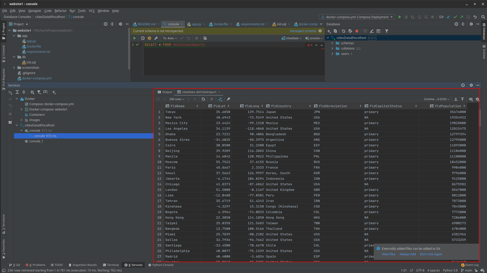
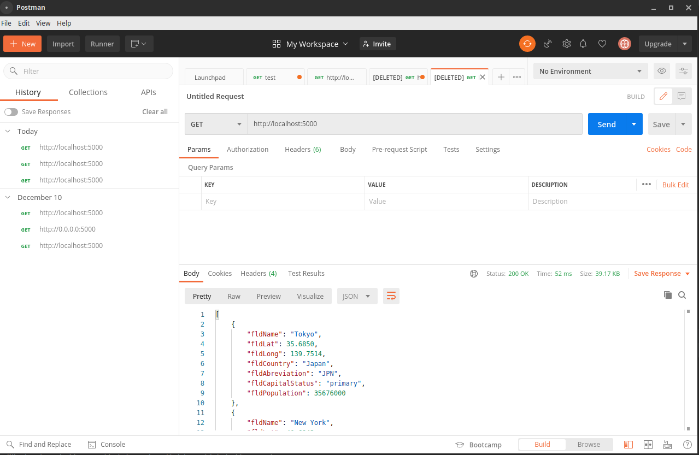

# Project Description
This project is a homework assignment to teach how to get pycharm setup with docker, flask, mysql

#Pycharm DBM Picture

#postman screenshot

Step 01 - Create new project done

Step 02 - Create the following following files:
* app (directory)
* db (directory)
* screenshots (directory)
* docker-compose.yml
* README.md

Step 03 - Add text to gitignore

Step 04 - populate docker-compose.yml

Step 05 - Add description to README.md

Step 06 - Missing from assignment

Step 07 - Add app.py, dockerfile, and requirements file

Step 08 - Populate python file

Step 09 - Populate dockerfile

Step 10 - Populate requirements

Step 11 - Create init.sql in db

Step 12 - Copy init.sql to my init.sql

Step 13 - Run project and do get request

